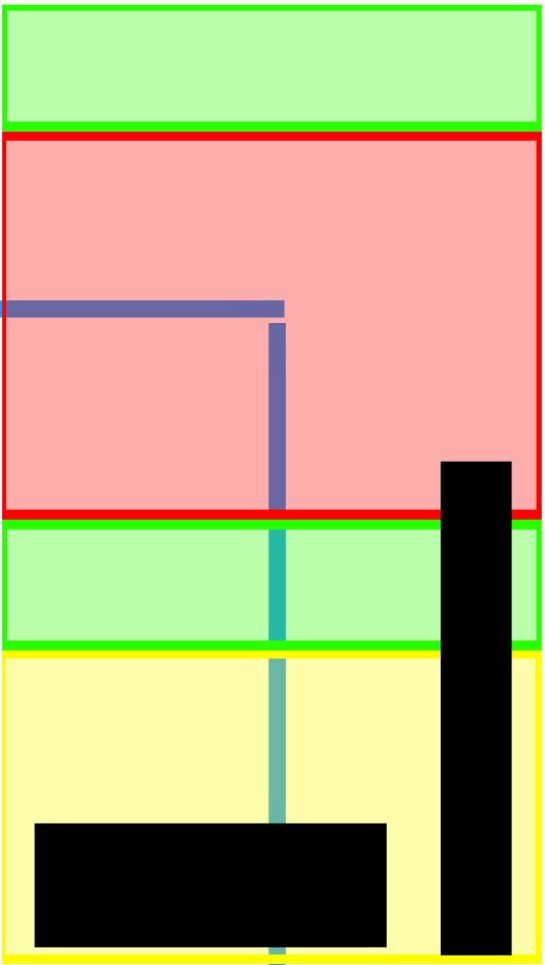

# Vertical (9:16) reframe & caption safe zones

Layout rules for turning a horizontal talking-head into a vertical Short / Reel /
Spotlight. Derived from the reference diagram (`vertical-safe-zones.jpeg`), which
maps where a viewer's eye actually lands and where each platform's UI chrome sits.



## The zones (fractions of a 1080×1920 frame)

| Zone | Vertical span | % of height | Purpose |
|------|---------------|-------------|---------|
| Top green | y 0 → 261 | 0 – 13.6% | Headroom / above-the-fold breathing space. Nothing critical. |
| **Red zone** | **y 263 → 1014** | **13.7 – 52.8%** | **Eye-landing zone.** The subject's face lives here and must never leave it. |
| Green band | y 1035 → 1296 | 53.9 – 67.5% | Caption-safe band (bottom of red → green). |
| Yellow | y 1296 → 1882 | 67.5 – 98% | Lower / risky. Avoid meaningful content. |

### Overlay UI to avoid (platform chrome)
- **Right action rail** (like / comment / share): x 874 → 1011 (80.9 – 93.6% width), lower half of frame. Keep subject and captions clear of it.
- **Bottom info bar** (handle, caption, audio): y 1640 → 1882 (85.4 – 98% height), left ~72%. Never place burned-in captions here.

## Face placement

- **Target:** the blue crosshair intersection — **x = 50.8% (horizontal center), y = 32.0%** (upper third).
  In a 1080×1920 frame that's roughly **(549, 614)**.
- **Hard constraint:** the face must **remain inside the red zone (13.7 – 52.8% height)** for the entire clip.
- For a locked-off wide shot where the subject drifts (leans forward/back), **auto-reframe per cut**:
  center the crop on the subject's median face position within each segment so the face
  snaps back to (center, ~32%) at every cut. Add a gentle pan only if the subject moves
  far enough within a single segment to leave the red zone.

### Crop math (per segment)
Given the subject's face point in the *source* `(fx, fy)`, a crop of size `W×H`
(9:16, i.e. `H = W*16/9`) scaled to 1080×1920 lands the face on target when:

```
crop_x = fx - 0.508 * W        # 0.508 = horizontal target
crop_y = fy - 0.320 * H        # 0.320 = vertical target
```

Pick `W` per segment so the head is a consistent size (tighter when the subject
is far, wider when close), then clamp `crop_x/crop_y` so the crop stays inside the
source frame and the face stays in the red zone.

## Caption placement

- **Horizontally centered.**
- **Vertical center ≈ 57%** of the frame (y ≈ 1094 on 1080×1920) — the bottom of the
  red zone spilling into the green band. This sits directly below the face, above all
  UI chrome, right where the eye already is.
- Keep max text width ≈ 900px so lines never collide with the right action rail.
- Implementation: ASS `Alignment=5` (middle-center) with a positive `MarginV`/`\pos`
  offset to reach ~57%, or `Alignment=2` with a large `MarginV`. Captions are still
  applied **last** in the filter chain (see SKILL.md Hard Rule 1).

## Quick reference (constants)

```
FACE_TARGET_X   = 0.508
FACE_TARGET_Y   = 0.320
RED_ZONE_TOP    = 0.137
RED_ZONE_BOTTOM = 0.528
CAPTION_CENTER_Y = 0.57
RIGHT_RAIL_X    = 0.809   # keep content left of here in the lower half
BOTTOM_BAR_Y    = 0.854   # keep captions above here
```
